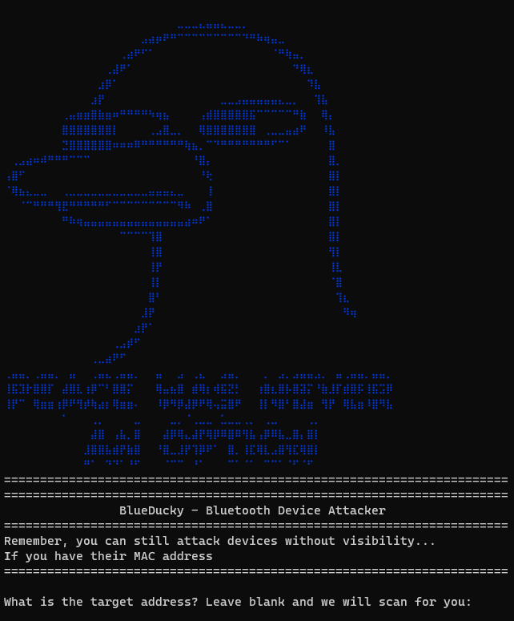

# BlueDucky 🦆

🚨 CVE-2023-45866 - BlueDucky Implementation (Using DuckyScript)
🔓 Unauthenticated Peering Leading to Code Execution (Using HID Keyboard)

[This is an implementation of the CVE discovered by marcnewlin](https://github.com/marcnewlin/hi_my_name_is_keyboard)

<p align="center">
  
</p>

## Introduction 📢
BlueDucky is a powerful tool for exploiting a vulnerability in Bluetooth devices. By running this script, you can:

1. 📡 Load saved Bluetooth devices that are no longer visible but have Bluetooth still enabled.
2. 📂 Automatically save any devices you scan.
3. 💌 Send a default message ("Hello There") if no `payload.txt` is present.

I've successfully run this on a Raspberry Pi 4 using the default Bluetooth module. It works against various phones, with an interesting exception for a New Zealand brand, Vodafone.

## Installation and Usage 🛠️

### Setup Instructions

```bash
# update apt
sudo apt-get update
sudo apt-get -y upgrade

# install dependencies from apt
sudo apt install -y bluez-tools bluez-hcidump libbluetooth-dev \
                    git gcc python3-pip python3-setuptools \
                    python3-pydbus

# install pybluez from source
git clone https://github.com/pybluez/pybluez.git
cd pybluez
sudo python3 setup.py install

# build bdaddr from the bluez source
cd ~/
git clone --depth=1 https://github.com/bluez/bluez.git
gcc -o bdaddr ~/bluez/tools/bdaddr.c ~/bluez/src/oui.c -I ~/bluez -lbluetooth
sudo cp bdaddr /usr/local/bin/
```

## Running BlueDucky
```bash
git clone https://github.com/pentestfunctions/BlueDucky.git
cd BlueDucky
python3 BlueDucky.py
```

## Operational Steps 🕹️
1. On running, it prompts for the target MAC address.
2. Pressing nothing triggers an automatic scan for devices.
3. Devices previously found are stored in known_devices.txt.
4. If known_devices.txt exists, it checks this file before scanning.
5. Executes using payload.txt file.
6. Successful execution will result in automatic connection and script running.

## Duckyscript 💻
🚧 Work in Progress:

- Implementing keyboard combinations.
- Current implementations:
6.1 REM (Comment)
6.2 STRING (Text Input)


#### 📝 Example payload.txt:
```bash
REM This is a comment and will not run
STRING hello there 123
```

## Enjoy experimenting with BlueDucky! 🌟


